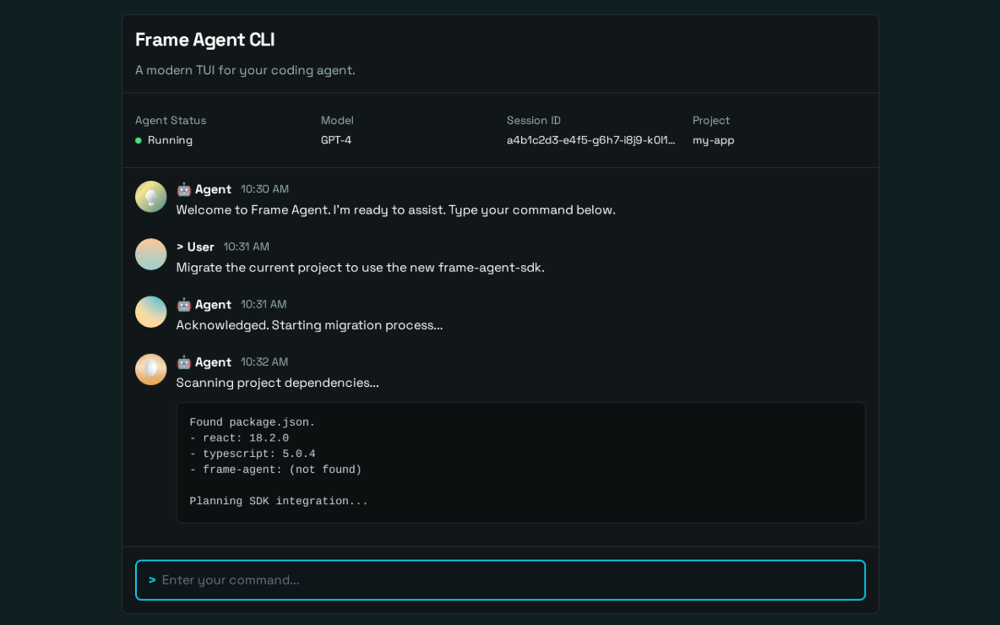

# 🎨 Plano de Implementação - TUI (Terminal User Interface)

## 🎯 Objetivo
Criar uma TUI **full-screen imersiva** (estilo OpenCode) usando **Blessed** para o modo `interactive`, transformando o terminal em uma aplicação completa para interação com o agente.

**Inspiração:** OpenCode (TUI nativo com Bubble Tea em Go)  
**Stack:** Blessed (Node.js/TypeScript)  
**Escopo:** Apenas comando `interactive`, `ask` mantém console.log simples

---

## 🔀 Modos de Operação do Agente

### **Modo 1: Autônomo (PADRÃO)** 🤖
**Comando:** `frame-code ask "tarefa"`

**Comportamento:**
- Agente executa tarefa **sem interação** com usuário
- Trabalha de forma independente até conclusão
- Output simples em console.log (sem TUI)
- Use case: CI/CD, scripts automatizados, tarefas batch

**Exemplo:**
```bash
$ frame-code ask "analise o projeto e crie relatório"
🤖 Analisando arquivos...
🔧 Lendo 50 arquivos...
🤖 Gerando relatório...
✅ Relatório criado em ./report.md
```

**Características:**
- ✅ Não requer input do usuário
- ✅ Execução start-to-finish
- ✅ Ideal para automação
- ❌ Sem TUI (console padrão)

---

### **Modo 2: Interativo (TUI)** 💬
**Comando:** `frame-code interactive`

**Comportamento:**
- Usuário **conversa** com agente
- Chat bidirecional contínuo
- TUI full-screen (interface rica)
- Use case: Desenvolvimento assistido, exploração de código, pair programming

**Exemplo:**
```bash
$ frame-code interactive
╭─────────────────────────────────╮
│ 🤖 frame-agent | gpt-4o-mini     │
├──────────┬──────────────────────┤
│ 🔧 Proc  │ 👤 Você: Cria arquivo│
│          │ 🤖 Agente: Criado!   │
├──────────┴──────────────────────┤
│ > ▊                              │
╰─────────────────────────────────╯
```

**Características:**
- ✅ Interação contínua
- ✅ TUI full-screen
- ✅ Human-in-the-loop
- ✅ Visualização de processos
- ❌ Não ideal para automação

---

## ⚠️ IMPORTANTE: Escopo do TUI

**O TUI É APENAS PARA MODO INTERATIVO.**

- ❌ Modo autônomo (`ask`) **NÃO usa TUI**
- ✅ Modo interativo (`interactive`) **USA TUI**

**Justificativa:**
- Modo autônomo roda em CI/CD, scripts, ambientes sem terminal interativo
- TUI full-screen seria inapropriado para uso não-interativo
- Separação clara de concerns

---

## 📊 Estado Atual

### Comandos CLI Existentes:
```bash
frame-code ask "pergunta"      # One-shot (console.log) → MANTÉM
frame-code interactive          # Chat loop (readline)  → VIRA TUI
```

### Arquitetura Atual (interactive):
```
cli.ts (readline)
  ↓
processQuestion(input)
  ↓
graph.execute(state)
  ↓
toolDetectionWrapper
  ↓
messageFormatter.ts
  ↓
console.log ❌
```

### Integração Existente (Aproveitar):
```typescript
// cli.ts - linha 133
const processQuestion = async (question: string) => {
  currentState.messages.push({ role: 'user', content: question });
  const result = await graph.execute(currentState);
  currentState = result.state;
  // messageFormatter já é chamado automaticamente
}
```

---

## 🎨 Design Visual

### Referência:


### Layout Alvo:
```
╭─────────────────────────────────────────────────────╮
│ 🤖 frame-agent | gpt-4o-mini | Provider: openai    │ ← Header
├──────────┬──────────────────────────────────────────┤
│          │                                          │
│ 🔧 Proc  │ 💬 Chat Area                            │
│          │                                          │
│ • dev    │ 👤 Você: Cria um arquivo                 │
│   (2m)   │                                          │
│          │ 🤖 Agente: Vou criar para você...        │
│ • test   │                                          │
│   (30s)  │ 🔧 Tool: file_create                     │
│          │    { "path": "test.txt" }                │
│          │                                          │
│          │ 🤖 Agente: Arquivo criado!               │
│          │                                          │
│ (scroll) │ (scroll infinito)                        │
│          │                                          │
├──────────┴──────────────────────────────────────────┤
│ > Digite sua mensagem... ▊                          │ ← Input
├─────────────────────────────────────────────────────┤
│ 💬 3.2K tokens | ⚡ 2 processes                      │ ← Footer/Stats
╰─────────────────────────────────────────────────────╯
```

### Proporções:
- **Sidebar:** 20% largura (fixa)
- **Chat:** 80% largura (flexível)
- **Header:** 1 linha
- **Input:** 3 linhas
- **Footer:** 1 linha
- **Chat/Sidebar altura:** 100% - header - input - footer

---

## 🗺️ Roadmap de Implementação

### **Fase 1: TUI Básica** (1 semana)

#### Objetivos:
1. Blessed full-screen app
2. Layout 3 áreas (sidebar, chat, input)
3. Substituir readline por Blessed textbox
4. Integração com `processQuestion()` existente
5. messageFormatter escreve no TUI ao invés de console

#### Arquitetura:

```
cli.ts (modificado)
  ↓
createTUI(config, graph)  ← NOVO
  ↓
blessed.screen (full-screen)
  ↓
processQuestion(input)  ← MESMO DO CLI.TS
  ↓
graph.execute()
  ↓
messageFormatter → outputAdapter → tui.addMessage() ← NOVO
```

#### Componentes Blessed:

```typescript
// src/ui/tui.ts
import blessed from 'blessed';

export function createTUI(config: any, graph: any) {
  // 1. Screen (full-screen, alternate buffer)
  const screen = blessed.screen({
    smartCSR: true,
    fullUnicode: true,
    title: 'frame-agent',
    cursor: {
      artificial: true,
      shape: 'line',
      blink: true
    }
  });
  
  // 2. Header
  const header = blessed.box({
    parent: screen,
    top: 0,
    left: 0,
    width: '100%',
    height: 1,
    content: `🤖 frame-agent | ${config.model} | Provider: ${config.provider}`,
    style: { fg: 'cyan', bold: true }
  });
  
  // 3. Sidebar (processos)
  const sidebar = blessed.box({
    parent: screen,
    top: 1,
    left: 0,
    width: '20%',
    height: '100%-5', // Menos header + input + footer
    label: '🔧 Processes',
    border: { type: 'line' },
    style: {
      border: { fg: 'cyan' }
    },
    scrollable: true,
    alwaysScroll: true,
    scrollbar: {
      ch: '█',
      style: { bg: 'cyan' }
    }
  });
  
  // 4. Chat (scrollable infinito)
  const chat = blessed.box({
    parent: screen,
    top: 1,
    left: '20%',
    width: '80%',
    height: '100%-5',
    label: '💬 Chat',
    border: { type: 'line' },
    style: {
      border: { fg: 'cyan' }
    },
    scrollable: true,
    alwaysScroll: true,
    scrollbar: {
      ch: '█',
      style: { bg: 'cyan' }
    },
    mouse: true,
    keys: true,
    vi: true  // j/k para scroll
  });
  
  // 5. Input
  const input = blessed.textbox({
    parent: screen,
    bottom: 1,
    left: 0,
    width: '100%',
    height: 3,
    label: '> ',
    border: { type: 'line' },
    style: {
      border: { fg: 'green' },
      focus: { border: { fg: 'green' } }
    },
    inputOnFocus: true,
    keys: true,
    mouse: true
  });
  
  // 6. Footer (stats)
  const footer = blessed.box({
    parent: screen,
    bottom: 0,
    left: 0,
    width: '100%',
    height: 1,
    content: '💬 0 tokens | ⚡ 0 processes',
    style: { fg: 'gray' }
  });
  
  // Estado
  let currentState: any = { messages: [], data: {}, status: 'RUNNING' };
  let processes: any[] = [];
  let isExecuting = false;
  
  // API pública
  return {
    addMessage: (type: 'user' | 'agent' | 'tool' | 'system', content: string) => {
      const icons = { user: '👤', agent: '🤖', tool: '🔧', system: 'ℹ️' };
      const colors = { user: 'white', agent: 'magenta', tool: 'cyan', system: 'gray' };
      
      blessed.box({
        parent: chat,
        content: `${icons[type]} ${type}: ${content}`,
        height: 'shrink',
        style: { fg: colors[type] }
      });
      
      chat.setScrollPerc(100); // Auto-scroll
      screen.render();
    },
    
    addProcess: (proc: any) => {
      processes.push(proc);
      updateSidebar();
    },
    
    updateProcess: (id: string, updates: any) => {
      const proc = processes.find(p => p.id === id);
      if (proc) Object.assign(proc, updates);
      updateSidebar();
    },
    
    removeProcess: (id: string) => {
      processes = processes.filter(p => p.id !== id);
      updateSidebar();
    },
    
    updateStats: (tokens: number) => {
      footer.setContent(`💬 ${tokens} tokens | ⚡ ${processes.length} processes`);
      screen.render();
    },
    
    start: async () => {
      // Focus no input
      input.focus();
      
      // Input submit
      input.on('submit', async (value) => {
        if (!value.trim()) {
          input.clearValue();
          screen.render();
          return;
        }
        
        // Adicionar mensagem do usuário
        addMessage('user', value);
        input.clearValue();
        
        // Processar (mesmo do cli.ts)
        isExecuting = true;
        try {
          await processQuestion(value);
        } catch (error) {
          addMessage('system', `❌ Erro: ${error.message}`);
        }
        isExecuting = false;
        
        input.focus();
        screen.render();
      });
      
      // Keybindings
      screen.key(['escape'], () => {
        if (isExecuting) {
          // TODO: Implementar abort quando tiver AbortController
          addMessage('system', '⏸️ Execução cancelada');
          isExecuting = false;
        } else {
          cleanup();
        }
      });
      
      screen.key(['C-c'], () => cleanup());
      screen.key(['C-l'], () => {
        chat.setContent('');
        screen.render();
      });
      
      // Render inicial
      screen.render();
    }
  };
  
  // Helpers
  function updateSidebar() {
    sidebar.setContent('');
    processes.forEach(proc => {
      blessed.box({
        parent: sidebar,
        content: `• ${proc.name} (${formatUptime(proc.uptime)})`,
        height: 1,
        style: { 
          fg: proc.status === 'running' ? 'green' : 
              proc.status === 'error' ? 'red' : 'gray' 
        }
      });
    });
    screen.render();
  }
  
  function cleanup() {
    // Matar todos processos background
    processes.forEach(async (proc) => {
      if (proc.status === 'running') {
        // Integração futura com terminal tools
        // await terminalStopTool.execute({ processId: proc.id });
      }
    });
    
    screen.destroy();
    process.exit(0);
  }
  
  function formatUptime(seconds: number): string {
    const m = Math.floor(seconds / 60);
    const s = seconds % 60;
    return m > 0 ? `${m}m${s}s` : `${s}s`;
  }
}
```

#### Integração com messageFormatter:

```typescript
// src/core/messageFormatter.ts (modificado)
import type { IToolCall } from 'frame-agent-sdk';

// Adapter para output (console ou TUI)
interface OutputAdapter {
  log: (type: string, message: string) => void;
}

let outputAdapter: OutputAdapter = {
  log: (type, msg) => console.log(`${type}: ${msg}`)
};

export function setOutputAdapter(adapter: OutputAdapter) {
  outputAdapter = adapter;
}

export function formatToolCallForTerminal(toolCall: IToolCall): void {
  if (toolCall.toolName === 'final_answer') {
    const answer = (toolCall.params as any)?.answer || 'Resposta não especificada';
    outputAdapter.log('agent', answer);
    return;
  }
  
  if (toolCall.toolName === 'ask_user') {
    const question = (toolCall.params as any)?.question || 'Pergunta não especificada';
    outputAdapter.log('agent', `Pergunta: ${question}`);
    return;
  }
  
  // Outras tools
  outputAdapter.log('tool', `Executando: ${toolCall.toolName}\nParams: ${JSON.stringify(toolCall.params, null, 2)}`);
}

export function formatAssistantMessage(content: string): void {
  outputAdapter.log('agent', content);
}
```

#### Modificação em cli.ts:

```typescript
// src/core/cli.ts (comando interactive)
import { createTUI } from '../ui/tui';
import { setOutputAdapter } from './messageFormatter';

program
  .command('interactive')
  .action(async () => {
    await loadConfigAsync();
    await ensureAgentsRegistered();
    await initializeTools();
    
    const graph = await createAgentGraph();
    const tui = createTUI(config, graph);
    
    // Conectar messageFormatter ao TUI
    setOutputAdapter({
      log: (type, msg) => tui.addMessage(type as any, msg)
    });
    
    // Iniciar TUI
    await tui.start();
  });
```

---

### **Fase 2: Processos e Stats** (1 semana)

#### Objetivos:
1. Integração com ferramentas de terminal (Fase 1)
2. Atualização automática de processos (polling)
3. Contagem de tokens em tempo real
4. Streaming de respostas do LLM

#### Implementação:

```typescript
// Hook para monitorar processos
function startProcessMonitoring(tui: any) {
  setInterval(async () => {
    for (const proc of processes) {
      if (proc.status === 'running') {
        // Chamar terminal_status (quando implementado)
        // const status = await terminalStatusTool.execute({ processId: proc.id });
        // tui.updateProcess(proc.id, { uptime: status.uptime });
      }
    }
  }, 2000); // Poll a cada 2s
}

// Hook para contar tokens
function updateTokenCount(tui: any, state: any) {
  const tokens = state.messages.reduce((total, msg) => {
    return total + (msg.content?.length || 0);
  }, 0);
  
  tui.updateStats(Math.floor(tokens / 4)); // Aproximação 4 chars = 1 token
}
```

#### Streaming de Respostas:

```typescript
// SDK já tem streaming (stream.ts)
// Atualizar messageFormatter para streaming

export function formatStreamingResponse(chunk: string): void {
  outputAdapter.log('agent-stream', chunk);
}

// TUI adiciona ao último box ao invés de criar novo
addMessage: (type, content) => {
  if (type === 'agent-stream') {
    const lastBox = chat.children[chat.children.length - 1];
    if (lastBox) {
      lastBox.setContent(lastBox.content + content);
    } else {
      // Primeiro chunk, criar box
      blessed.box({
        parent: chat,
        content: `🤖 Agent: ${content}`,
        height: 'shrink'
      });
    }
  } else {
    // Mensagem completa (como antes)
  }
  screen.render();
}
```

---

### **Fase 3: Polimento** (3-5 dias)

#### Objetivos:
1. Cores e temas
2. Animações (spinner durante execução)
3. Keybindings extras (Ctrl+P, Ctrl+K, etc.)
4. Help screen (?)
5. Preparar para histórico futuro (arquitetura extensível)

#### Features:

```typescript
// Spinner durante execução
const spinner = blessed.loading({
  parent: chat,
  border: 'line',
  style: { border: { fg: 'yellow' } }
});

// Mostrar durante graph.execute()
spinner.load('🔄 Processando...');
await graph.execute();
spinner.stop();

// Help screen (toggle com ?)
screen.key(['?'], () => {
  showHelpPopup();
});

// Histórico (preparar estrutura)
interface SessionHistory {
  messages: Message[];
  processes: ProcessInfo[];
  timestamp: Date;
}

// Salvar ao fechar (futuro)
function saveSession(history: SessionHistory) {
  // TODO: Implementar salvamento em JSON/SQLite
  // fs.writeFileSync('.frame-agent-history.json', JSON.stringify(history));
}
```

---

## 📐 Estrutura de Arquivos

```
src/
├── ui/
│   ├── tui.ts                 # App principal Blessed
│   ├── components/
│   │   ├── header.ts         # Header component
│   │   ├── sidebar.ts        # Sidebar de processos
│   │   ├── chat.ts           # Área de chat
│   │   ├── input.ts          # Input box
│   │   └── footer.ts         # Footer com stats
│   ├── hooks/
│   │   ├── useProcessMonitoring.ts
│   │   └── useTokenCount.ts
│   └── theme.ts              # Cores e estilos
├── core/
│   ├── cli.ts                # Modificado: usa TUI
│   ├── messageFormatter.ts   # Modificado: outputAdapter
│   ├── agentFlow.ts          # INALTERADO
│   └── toolDetectionWrapper.ts # INALTERADO
└── tools/
    └── terminal/             # Compatível com plan-terminal-tools.md
```

---

## 🔗 Integração TUI ↔️ Terminal Tools

### Fluxo:

```
1. LLM chama terminal_background
   ↓
2. toolDetectionWrapper intercepta
   ↓
3. messageFormatter.log('tool', ...)
   ↓
4. outputAdapter → tui.addMessage('tool', ...)
   ↓
5. Tool executa e retorna processId
   ↓
6. tui.addProcess({ id, name, command, status: 'starting' })
   ↓
7. Sidebar atualiza automaticamente
   ↓
8. Polling atualiza status a cada 2s
```

### Compatibilidade (plan-terminal-tools.md):

| Terminal Tool | TUI Action |
|---------------|------------|
| `terminal_execute` | Mostrar spinner → resultado |
| `terminal_background` | Adicionar à sidebar |
| `terminal_status` | Atualizar uptime na sidebar |
| `terminal_logs` | (Fase futura: mostrar no chat) |
| `terminal_stop` | Remover da sidebar |
| `terminal_list` | Popular sidebar inicial |

---

## ✅ Critérios de Sucesso

### Fase 1:
- [ ] TUI renderiza full-screen
- [ ] Layout 3 áreas (sidebar, chat, input)
- [ ] Input funciona (submit com Enter)
- [ ] Mensagens aparecem no chat
- [ ] ESC cancela execução ou fecha
- [ ] Ctrl+C fecha corretamente
- [ ] messageFormatter escreve no TUI
- [ ] processQuestion() funciona igual ao readline

### Fase 2:
- [ ] Processos aparecem na sidebar
- [ ] Status atualiza a cada 2s
- [ ] Footer mostra tokens e processos
- [ ] Streaming de respostas funciona

### Fase 3:
- [ ] Spinner durante execução
- [ ] Help screen (?)
- [ ] Cores consistentes
- [ ] Cleanup mata processos ao fechar

---

## 📦 Dependências

```bash
npm install blessed
npm install -D @types/blessed
```

**Opcional (Fase 3):**
```bash
npm install blessed-contrib  # Graphs, widgets extras
```

---

## 🚨 Requisitos de Sistema

### Terminal:
- ✅ **Git Bash** (Windows) - Recomendado
- ✅ **WSL** (Windows) - Perfeito
- ✅ **iTerm2/Terminal.app** (macOS)
- ✅ **GNOME Terminal/Konsole** (Linux)
- ❌ **CMD.exe** - Não suportado

### Documentação:
```markdown
# Requisitos

## Windows
Requer **Git Bash** ou **WSL** para melhor experiência.
CMD.exe não é suportado.

## Verificação
Execute `echo $TERM` no seu terminal.
Valores aceitos: xterm-256color, screen-256color
```

---

## 🔄 Histórico (Preparação Futura)

### Arquitetura Extensível:

```typescript
// src/core/history.ts (futuro)
interface SessionHistory {
  id: string;
  messages: Message[];
  processes: ProcessInfo[];
  startTime: Date;
  endTime?: Date;
}

class HistoryManager {
  async save(history: SessionHistory): Promise<void> {
    // TODO: Implementar
  }
  
  async load(id?: string): Promise<SessionHistory | null> {
    // TODO: Implementar
  }
  
  async list(): Promise<SessionHistory[]> {
    // TODO: Implementar
  }
}
```

### Flag para Restaurar:

```bash
frame-code interactive --restore-session  # Futuro
```

---

## 📊 Comparação: Antes vs. Depois

### Antes (readline):
```
.frame-agent CLI
==============================================
Modo Chat Interativo

Você: cria arquivo
🤖 Processando...
🤖 Agente: Vou criar...
🔧 Tool: file_create...
✅ Tarefa concluída!

Você: _
```

### Depois (Blessed TUI):
```
╭─────────────────────────────────────────────────────╮
│ 🤖 frame-agent | gpt-4o-mini | Provider: openai    │
├──────────┬──────────────────────────────────────────┤
│ 🔧 Proc  │ 👤 Você: cria arquivo                    │
│          │                                          │
│ • dev    │ 🤖 Agente: Vou criar...                  │
│   (2m)   │                                          │
│          │ 🔧 Tool: file_create                     │
│          │    { "path": "test.txt" }                │
│          │                                          │
│          │ 🤖 Agente: Arquivo criado!               │
├──────────┴──────────────────────────────────────────┤
│ > ▊                                                  │
├─────────────────────────────────────────────────────┤
│ 💬 3.2K tokens | ⚡ 1 processes                      │
╰─────────────────────────────────────────────────────╯
```

---

**Última atualização:** 2025-11-29  
**Status:** 📋 Planejamento Finalizado  
**Próximo passo:** Implementar Fase 1  
**Decisões:** Blessed, Git Bash required, Cleanup automático, Footer stats  
**Compatível com:** plan-terminal-tools.md (Fase 1)
